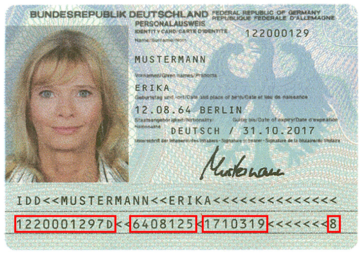
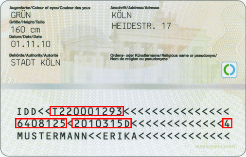

# German Identity Card validation (Neuer Personalausweis/Alter Personalausweis)
This package describes the validation process of the german identity card
(neuer deutscher Personalausweis/alter deutscher Personalausweis).

The document is build from different strings:

## String structure
The complete calculation procedure of the id validation can be described like this.

The following structure explains the parts that the id card string will be divided into.

- Serialnumber (based on authority code + consecutive number + checksum): 4 mixed characters + 4 mixed characters + 1 digit 
  Example: `T220001293` with 
  - Authority code (Behördenkennzahl; BKZ) ID: 4 mixed characters (`[A-Z0-9]{4}`) 
    Example: `T220`
  - Consecutive number: 5 digits 
    Example: `00129`
  - Checksum: 1 digit 
    Example: `3`
- Birth (birth date) + checksum: 6 digits + 1 digit 
  Example: `6408125` with 
    - `64` is the year of birth
    - `08` is the month of birth 
    - `12` is the day of birth 
    - `5` is the checksum
- Expiry (expire date) + checksum: 6 digits + 1 digit 
  Example: `2010315` with 
    - `20` is the year of expiry
    - `10` is the month of expiry
    - `31` is the day of expiry
    - `5` is the checksum
- Nationality: 1 uppercase character, usually `D` for "**D**eutschland" (= "Germany") 
  Example: `D`
- Total checksum: 1 digit 
  The checksum, with reference to all parts as explained above
  Example: `4`

## Further reading

### Insights
- [Behördenkennzahl; BKZ (external website)](http://www.pruefziffernberechnung.de/Begleitdokumente/BKZ.shtml)

### Generating random id card (Personalausweis) numbers (testing)
- [perso.xyz (external website)](https://www.perso.xyz/)
- [Calculation of the german id card checksums (external website)](http://www.pruefziffernberechnung.de/P/Personalausweis-DE.shtml)
