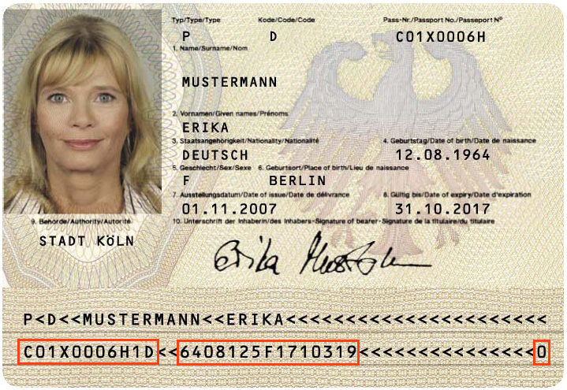

# German Passport validation (Reisepass)
This package describes the validation process of the german passport
(Reisepass).

More information can be found at
[BMI](https://www.bmi.bund.de/SharedDocs/downloads/DE/veroeffentlichungen/themen/moderne-verwaltung/ausweise/reisepass-flyer.pdf?__blob=publicationFile&v=3)

The document is build from different strings:

## String structure
The complete calculation procedure of the id validation can be described like this.

The following structure explains the parts that the passport string will be divided into.

- Serialnumber (based on authority code + consecutive number + checksum): 4 mixed characters + 4 mixed characters + 1 digit 
  Example: `C01X0006H1D` with 
  - Authority code (Behördenkennzahl; BKZ) ID: 4 mixed characters (`[A-Z0-9]{4}`) 
    Example: `C01X`
  - Consecutive number: 5 digits 
    Example: `0006H`
  - Checksum: 1 digit 
    Example: `1`
- Nationality: 1 uppercase character, usually `D` for "**D**eutschland" (= "Germany") 
  Example: `D`
- Birth (birth date) + checksum: 6 digits + 1 digit 
  Example: `6408125` with 
    - `64` is the year of birth
    - `08` is the month of birth 
    - `12` is the day of birth 
    - `5` is the checksum
- Gender 1 uppercase character for the gener (`F` = female; `M` = male) 
  Example: `F`
- Expiry (expire date) + checksum: 6 digits + 1 digit 
  Example: `2010315` with 
    - `17` is the year of expiry
    - `10` is the month of expiry
    - `31` is the day of expiry
    - `9` is the checksum
- Total checksum: 1 digit 
  The checksum, with reference to all parts as explained above
  Example: `0`

## Further reading

### Insights
- [Behördenkennzahl; BKZ (external website)](http://www.pruefziffernberechnung.de/Begleitdokumente/BKZ.shtml)

### Generating random passport (Personalausweis) numbers (testing)
- [perso.xyz (external website)](https://www.perso.xyz/)
- [Calculation of the german passport checksums (external website)](http://www.pruefziffernberechnung.de/R/Reisepass-DE.shtml)
