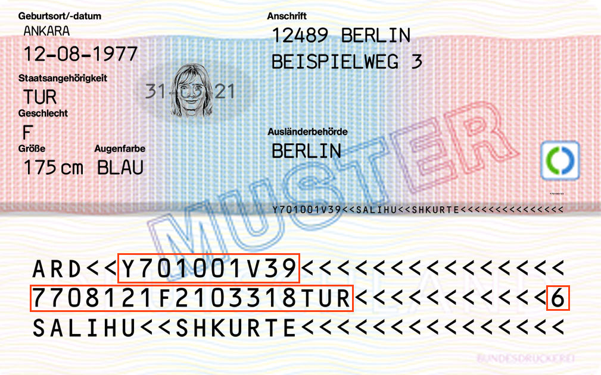

# German residence authorization validation (eAufenthaltstitel/EAT)
This package describes the validation process of the german residence authorization card
(eAufenthaltstitel/EAT).

More information can be found at 
[BAMF](https://www.bamf.de/SharedDocs/Anlagen/DE/MigrationAufenthalt/ElektronischerAufenthalt/broschuere-eat-a4.pdf;jsessionid=7DD2EF9C308D3AA67FB0AAC58A962B4A.internet571?__blob=publicationFile&v=12).

The document is build from different strings:

## String structure
The complete calculation procedure of the id validation can be described like this.

The following structure explains the parts that the id card string will be divided into.

- Serialnumber (based on authority code + consecutive number + checksum): 4 mixed characters + 4 mixed characters + 1 digit 
  Example: `Y701001V39` with 
  - Authority code (Behördenkennzahl; BKZ) ID: 4 mixed characters (`[A-Z0-9]{4}`) 
    Example: `Y701`
  - Consecutive number: 5 digits 
    Example: `001V3`
  - Checksum: 1 digit 
    Example: `9`
- Birth (birth date) + checksum: 6 digits + 1 digit 
  Example: `7708121` with 
    - `77` is the year of birth
    - `08` is the month of birth 
    - `12` is the day of birth 
    - `1` is the checksum
- Gender 1 uppercase character for the gener (`F` = female; `M` = male) 
  Example: `F`
- Expiry (expire date) + checksum: 6 digits + 1 digit 
  Example: `2103318` with 
    - `21` is the year of expiry
    - `03` is the month of expiry
    - `31` is the day of expiry
    - `8` is the checksum
- Nationality: 3 uppercase character, i.e `TUR` for Turkey 
  Example: `TUR`
- Total checksum: 1 digit 
  The checksum, with reference to all parts as explained above
  Example: `6`

## Further reading

### Insights
- [Behördenkennzahl; BKZ (external website)](http://www.pruefziffernberechnung.de/Begleitdokumente/BKZ.shtml)
- [Behördenkennzahl; BKZ (external website)](http://www.pruefziffernberechnung.de/Begleitdokumente/BKZ.shtml)

### Generating random Personalausweis numbers (testing)
- [perso.xyz (external website)](https://www.perso.xyz/)
- [Calculation of the german idcard checksums (external website)](http://www.pruefziffernberechnung.de/P/Personalausweis-DE.shtml)
